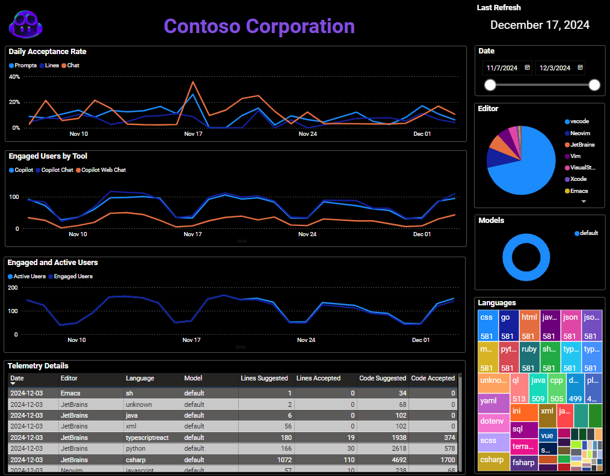
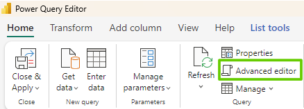
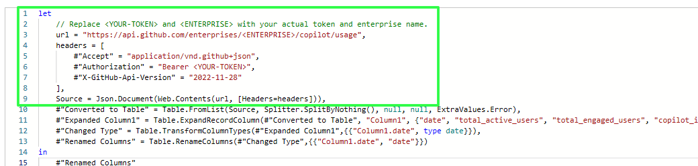
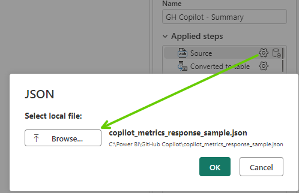

# GitHub Copilot Metrics Viewer for Power BI

With the release of the latest [GitHub Copilot Metrics API](https://github.com/orgs/community/discussions/141071) many teams are looking to leverage this data to help monitor usage against their KPIs. For some, the Copilot Metrics Viewer ([github-copilot-resources/copilot-metrics-viewer](https://github.com/github-copilot-resources/copilot-metrics-viewer)) might be a great option. 

However, many organizations that we work with already have established Power BI teams. If your organization is **already using Power BI, please read on!**

## New Features
- New metrics for Pull Request summaries and Copilot Chat on GitHub.com.
- Clarity on code completions and Copilot Chat usage in IDEs.
- User engagement summaries updated daily.
- Custom model slicing support, coming soon!
- Data can be aggregated by enterprise, organization or team.

Located in the  `./samples` directory you'll find sample JSON and PBIX files used to create the dashboard below.
> Note: The legacy GitHub Copilot Usage API is still available and can be used with the `GitHub Copilot - Telemetry Sample (Usage).pbix` file. For instructions, see [Usage_API.md](USAGE_API.md).



## Setup

### Connect to Metrics API
> Notes: The REST API provides metrics for the previous 28 days and is refreshed daily with data from the previous day. Please ensure you are using the latest version of the [REST API](https://docs.github.com/en/enterprise-cloud@latest/rest/copilot/copilot-metrics).

In order to connect we'll need to generate a token and link to your metrics data:
1. Download and open the sample `GitHub Copilot - Telemetry Sample (Metrics with KPI).pbix` file.
2. Determine if you'll be using the `Enterprise`, `Organization` or `Team` URL.
3. Follow the instructions below to generate a token with permissions to access the API:
   [REST API endpoints for Copilot metrics - GitHub Enterprise Cloud Docs](https://docs.github.com/en/enterprise-cloud@latest/rest/copilot/copilot-metrics)
>**IMPORTANT: Do not share this token and ensure you follow you organizations security policies.**
4. The file contains the following data sources, descriptions are inlcuded below.

    | Name                               | Description                                                   |
    | :--------------------------------- | :------------------------------------------------------------ |
    | config                             | Configuration used to display date of refresh and KPI dashboard |
    | source                             | Base source used to connect to API or local JSON files.       |
    | GH Copilot - dotcom chat           | Detailed metrics of code completions using chat on the web.   |
    | GH Copilot - ide chat              | Detailed metrics of code completions using chat within the IDE. |
    | GH Copilot - ide code completions  | Detailed metrics of code completions within the IDE.          |
    | GH Copilot - pull requests         | Detailed metrics of pull requests.                            |
    | GH Copilot - summary               | Daily summary of active and engaged users.                    |
5. Open the **Power Query Editor** by clicking **Transform data** in the top-menu and selecting **Tranform data**. 
6. Click on **source** in the left-menu.
7. Select **Advanced editor**.  
   
8. Replace the first 2 lines with following, ensure to replace `<YOUR-TOKEN>` along with the relevant `<ENTERPRISE>`, `<ORG>` and `<TEAM_SLUG>` with the values from step 2.  
  
    **Enterprise**
    ```powerquery
    let
        // Replace <YOUR-TOKEN> and <ENTERPRISE> with your actual token and enterprise name.
        url = "https://api.github.com/enterprises/<ENTERPRISE>/copilot/metrics",
        headers = [
            #"Accept" = "application/vnd.github+json",
            #"Authorization" = "Bearer <YOUR-TOKEN>",
            #"X-GitHub-Api-Version" = "2022-11-28"
        ],
        Source = Json.Document(Web.Contents(url, [Headers=headers])),
    ```

    **Enterprise Team**
    ```powerquery
    let
        // Replace <YOUR-TOKEN>, <ENTERPRISE> and <TEAM_SLUG> with your actual token and enterprise name.
        url = "https://api.github.com/enterprises/<ENTERPRISE>/team/<TEAM_SLUG>/copilot/metrics",
        headers = [
            #"Accept" = "application/vnd.github+json",
            #"Authorization" = "Bearer <YOUR-TOKEN>",
            #"X-GitHub-Api-Version" = "2022-11-28"
        ],
        Source = Json.Document(Web.Contents(url, [Headers=headers])),
    ```

    **Organization**
    ```powerquery
    let
        // Replace <YOUR-TOKEN> and <ORG> with your actual token and org name.
        url = "https://api.github.com/orgs/<ORG>/copilot/metrics",
        headers = [
            #"Accept" = "application/vnd.github+json",
            #"Authorization" = "Bearer <YOUR-TOKEN>",
            #"X-GitHub-Api-Version" = "2022-11-28"
        ],
        Source = Json.Document(Web.Contents(url, [Headers=headers])),
    ```

    **Team**
    ```powerquery
    let
        // Replace <YOUR-TOKEN>, <ORG> and <TEAM_SLUG> with your actual token and enterprise name.
        url = "https://api.github.com/orgs/<ORG>/team/<TEAM_SLUG>/copilot/metrics",
        headers = [
            #"Accept" = "application/vnd.github+json",
            #"Authorization" = "Bearer <YOUR-TOKEN>",
            #"X-GitHub-Api-Version" = "2022-11-28"
        ],
        Source = Json.Document(Web.Contents(url, [Headers=headers])),
    ```
8. Your Power Query will look something like this:  
   
9. Click **OK** to close the editor and select `Anonymous` authentication if prompted.
10. Click **Close and Apply** in the top-left of the **Power Query Editor**.
11. On the **Report View** page click **Refresh** to load the new data into your dashboard.

### Test: Modify the local JSON data source
> Note: This example provided a proof of concept for loading metrics data and requires an exported JSON file. If you have access to the REST API you can configure the **Source** accordingly.

1. Download and open the sample `GitHub Copilot - Telemetry Sample (Metrics with KPIs).pbix` file.
2. Open the **Power Query Editor** by clicking **Transform data** in the top-menu and selecting **Tranform data**. 
3. Click on **source** query in the left-menu
4. In the right-menu under **APPLIED STEPS** click the gear (settings) icon, selecting your JSON file and clicking **OK**.  
   
5. Click **Close and Apply** in the top-left of the **Power Query Editor**.
6. On the **Report View** page click **Refresh** to load the new data into your dashboard.
7. **Happy Customizing!**

## Publishing
If you need help deploying or publishing this script, please see: [Publish README](/publish/README.md)

## Maintainers

@jasonmoodie, @Eldrick19

## Support

These are just files for you to download and use as you see fit. If you have questions about how to use them, please reach out to the maintainers, but we cannot guarantee a response with SLAs.